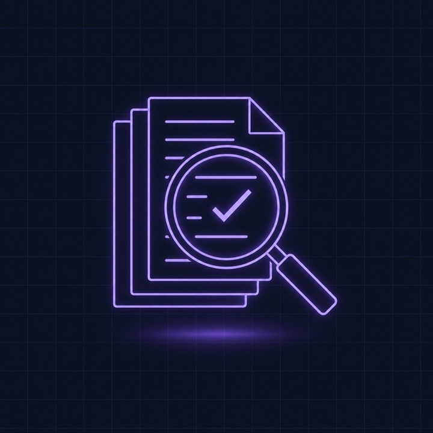
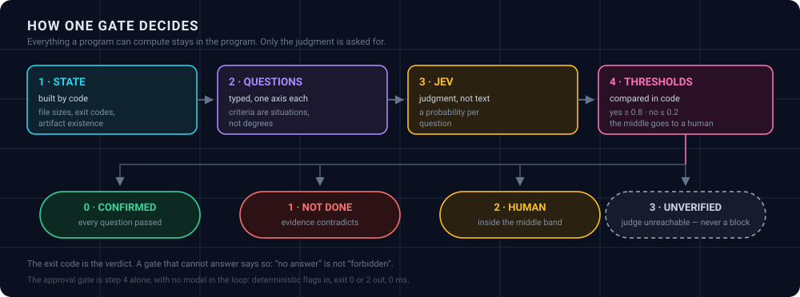

<div align="center">
  
</div>

<div align="center">

# Хватит говорить «готово» без доказательств.

Три небольших гейта между ИИ-агентом и последствиями его работы.
**Ни SDK, ни зависимостей, ни сервера.** Обычные скрипты на Node 18+, которые запустит любой харнесс.

[](https://github.com/cwjechw98-lang/jev-gates/actions/workflows/ci.yml)
[](LICENSE)
[](package.json)
[](package.json)
[](#-цена)
[](#три-гейта)

[Быстрый старт](#-быстрый-старт) · [Три гейта](#три-гейта) · [Любой харнесс](#-любой-харнесс) · [Правила формы](docs/DESIGN.md) · [English](README.md)

</div>

---

Агент отчитался об успехе. Ошибиться он может тремя способами, и каждый требует своей проверки.

<table>
<tr>
<td width="33%" valign="top">

### 🔒 Действует там, где надо было спросить

Запросы на одобрение отключают — ради скорости, ради автономных прогонов или потому что в
харнессе их нет. Тогда между агентом и force-push не остаётся ничего.

</td>
<td width="33%" valign="top">

### ✅ Говорит «готово» без доказательств

Обычно это не ложь: он прочитал собственный пересказ сделанного, а пересказ оказался
оптимистичным. Строгий промпт этого не лечит.

</td>
<td width="33%" valign="top">

### 🧪 Доверяет сломанной рубрике

Новый вопрос «да/нет» выглядит разумно, встраивается в пайплайн и тихо отвечает «да» на всё
подряд. Замечают это, только когда кто-то проверит проверку.

</td>
</tr>
</table>

Каждый гейт отвечает на **один узкий вопрос**. Всё, что можно посчитать кодом, считает код;
у модели спрашивают только суждение.

---

## Три гейта

<table>
<tr>
<td align="center" width="33%">
<br><br>
<b>🔒 Согласие</b><br>
<sub>перед необратимым действием</sub><br><br>
<code>0</code> можно &nbsp;·&nbsp; <code>2</code> спросить человека<br>
<sub><b>без модели, 0 мс, $0</b></sub>
</td>
<td align="center" width="33%">
<br><br>
<b>✅ Завершение</b><br>
<sub>перед словом «готово»</sub><br><br>
<code>0</code> подтверждено &nbsp;·&nbsp; <code>1</code> не сделано<br>
<code>2</code> человеку &nbsp;·&nbsp; <code>3</code> не подтверждено
</td>
<td align="center" width="33%">
<br><br>
<b>🧪 Рубрика</b><br>
<sub>перед доверием к рубрике</sub><br><br>
<code>0</code> прошла &nbsp;·&nbsp; <code>1</code> провалилась<br>
<sub><b>трое ворот, по порядку</b></sub>
</td>
</tr>
</table>

<div align="center">
  
</div>

Суждение выносит [TypeSafe Jev](https://www.typesafe.ai/) (System One): на входе состояние и
типизированный вопрос, на выходе **вероятность**. Не сгенерированный текст, а число, которое
код сравнивает с порогом.

---

## ⚡ Быстрый старт

Без установки и зависимостей, Node 18+:

```bash
git clone https://github.com/cwjechw98-lang/jev-gates.git
cd jev-gates
node --test test/selftest.mjs          # 18 проверок, без ключа и без сети
```

Гейту согласия ключ **не нужен вообще**:

```bash
node scripts/jev-gateway.mjs --action push_public --external --public --reversible=false
```

```
action: push_public
verdict: ASK A HUMAN
  reason: public_irreversible: published outward with no way back
  reason: external_irreversible: external action with no way back
(advice, not enforcement: this gate does nothing and blocks nothing)
```

Код возврата `2`. Двум другим нужен ключ TypeSafe: он читается из `TYPESAFE_API_KEY`, затем из
`$JEV_GATES_HOME/key`, затем из `~/.dsh/.credentials.yaml`, затем из `~/.config/jev-gates/key`.

```bash
export TYPESAFE_API_KEY=...
node scripts/jev.mjs check
# route: WORKING
# model: jev-1.13.0, yes probability: 0.9
# cost: $0.000012
```

---

## 🔒 Гейт 1 — перед необратимым действием

```bash
node scripts/jev-gateway.mjs --action delete_backup --destructive --reversible=false
echo '{"action":"edit_readme","reversible":true}' | node scripts/jev-gateway.mjs --quiet
node scripts/jev-gateway.mjs --rules        # вся таблица правил на один экран
```

Правила — это **данные, а не ветвления**, поэтому их можно прочитать и оспорить:

| Правило | Срабатывает, когда |
|---|---|
| `credential_out` | учётные данные уходят с машины |
| `destructive_irreversible` | разрушительно и без пути назад |
| `public_irreversible` | публикуется наружу без пути назад |
| `external_irreversible` | внешнее действие без пути назад |
| `bulk_irreversible` | массовая операция без пути назад |
| `undeclared` | действие не описано — судить нечего |

Необратимость считается только явно объявленной: `--reversible=false`. Всё остальное по
умолчанию обратимо, потому что гейт, мешающий рутинной работе, отключают в тот же день.

> [!WARNING]
> **Это рекомендация, а не запрет.** Гейт ничего не исполняет и ничего не блокирует — он
> говорит вызывающему, надо ли остановиться и спросить. И он не поймает неверно объявленные
> флаги: действие, описанное как безопасное, но разрушительное, пройдёт. Честно описать
> действие — часть работы, а не бумажная формальность.

---

## ✅ Гейт 2 — перед словом «готово»

Порядок жёсткий: **сделать работу → прочитать цель → собрать доказательства → судить.**
Судить отчёт об успехе, не прочитав цель, — это добавить ещё одно мнение, а не доказательство.

Записываем, что именно утверждается и чем это проверяется кодом:

```json
{
  "task": "fix the failing test in src/a.ts",
  "claimed": "the test is green, the type check and the linter are green too",
  "criteria": ["the previously failing test passes", "the changed file was read back after writing"],
  "evidence": {
    "writes": [{ "path": "src/a.ts", "bytes": 1204, "read_after": true }],
    "commands": [
      { "cmd": "npx vitest run src/a.test.ts", "exit": 0, "expect_exit": 0, "tail": "Tests 3 passed" },
      { "cmd": "npx tsc --noEmit", "exit": 0, "expect_exit": 0 }
    ],
    "artifacts": [{ "path": "reports/test-fix.md", "bytes": 812, "exists": true }]
  }
}
```

```bash
node scripts/jev-gate.mjs --claims examples/claims.example.json --dry   # что увидит модель
node scripts/jev-gate.mjs --claims examples/claims.example.json
```

`--dry` печатает посчитанное состояние и вопросы, не вызывая никого, — самый дешёвый способ
понять, стоят ли ваши доказательства судейства.

Вывод разделяет **посчитанное кодом** и **вынесенное моделью**:

```
VERDICT: CONFIRMED
reason: all 6 questions passed
evidence: {"writes":1,"writesRead":1,"commands":3,"cmdsOk":3,"artifacts":1,"artsOk":1,"criteria":3}

  read_after_write     0.98   yes
  reproduced           0.96   yes
  artifacts_present    0.96   yes
  criterion_1          0.94   yes
  criterion_2          0.97   yes
  criterion_3          0.98   yes

model jev-1.13.0, input 975 tokens, $0.000041
limit: this gate checks that the evidence is consistent, not that it is true.
```

Неприменимые вопросы **не задаются**. Нет файлов, команд, артефактов и критериев — судить
нечего, гейт выходит с кодом `3` и сообщением «NOTHING TO CHECK». Это не «готово», это
отсутствие доказательств.

> [!IMPORTANT]
> **Чего он не делает:** проверяет согласованность доказательств с утверждением, а не их
> правдивость. Выдуманные, но связные факты пройдут. Именно поэтому доказательства собирает
> код — размеры файлов, коды возврата, наличие артефактов, — а не пишет прозой агент.

---

## 🧪 Гейт 3 — перед тем, как довериться рубрике

Рубрика — это прибор, а прибор начинается как подозреваемый. `jev-evals` прогоняет трое ворот
в фиксированном порядке:

| # | Ворота | Вопрос |
|---|---|---|
| 1 | **Известные ответы** | Кейсы, ответ на которые известен заранее. Рубрика их берёт? |
| 2 | **Устойчивость** | Те же кейсы в обратном порядке. Вердикты держатся или решает позиция? |
| 3 | **Контроль прибора** | Тот же вопрос против состояния, где признак **убран**. Ответ сдвинулся? |

> [!CAUTION]
> Если провалены первые ворота, устойчивость **не считается**. Детерминированно неверный
> ответ воспроизводится идеально, и «100% устойчивости» на нём не значит ничего. Это не
> гипотеза: дрейф 0.006 при 100% устойчивости и всех неверных ответах уже наблюдался.

```bash
node scripts/jev-evals.mjs run fixtures/claim-support.json
node scripts/jev-evals.mjs template > fixtures/my-rubric.json    # начать с заполненного примера
```

```
rubric: claim-support, cases: 4, model: jev-1.13.0
gates: accuracy >= 0.9, drift <= 0.2, stability and control when data exists

1. known answers: 4/4 = 100%
2. stability (reverse order): flips 0, max drift 0.000
3. instrument control (feature removed): 1/1

main pass cost: 1461 tokens, $0.000061
RUBRIC PASSED ALL GATES
```

Фикстура в репозитории — **это рубрика самого гейта завершения**: гейты тоже под гейтами.

---

## 📓 Куда попадают решения

Каждый гейт дописывает строку в журнал JSONL: версия модели, отпечатки состояния и вопросов,
**полное распределение**, использованные пороги и вердикт.

```bash
node scripts/jev-decisions.mjs summary
```

```
decision records: 5
by kind:     {"gateway":2,"evals":1,"gate":2}
by verdict:  {"human":1,"allow":1,"ok":1,"not_done":1,"done":1}
input: 3946 tokens, cost: $0.00019
```

Полное распределение важно: **«0.91 против 0.05» и «0.36 против 0.34» — разные новости**, и по
одной победившей метке их не различить. Журнал же делает пороги предметом спора: набрав
записей, порог можно вывести из целевой точности, а не назначать на ощупь.

Журналы пишутся рядом со скриптами или в `$JEV_GATES_HOME`, если переменная задана.

---

## 🔌 Любой харнесс

Требование к харнессу маленькое: **выполнить команду, прочитать код возврата и, если нужно,
передать JSON на stdin.** Больше ничего.

| Харнесс | Статус | Где работает гейт |
|---|---|---|
| **Claude Code** | ✅ сверено с [документацией хуков](https://code.claude.com/docs/en/hooks) | `PreToolUse` для согласия, `Stop` для завершения, в `.claude/settings.json` |
| **GitHub Actions** | ✅ сверено с [документацией контекстов](https://docs.github.com/en/actions/reference/workflows-and-actions/contexts) | обычные шаги workflow; гейту согласия в CI места нет |
| **DeepSeek Harness, Codex, агенты с AGENTS.md** | 📄 только контракт | правило, которое агент обязан выполнить до объявления задачи сделанной |
| **git-хуки, обычный shell** | 📄 только контракт | `.git/hooks/pre-push`; ненулевой код отменяет push |
| **Cursor, opencode, Hermes, Aider** | 📄 только контракт | там, где харнесс умеет выполнить команду |

**→ [docs/HARNESSES.md](docs/HARNESSES.md)** содержит рецепты, включая тонкость, которая
решает дело: у гейта согласия код `2` значит *спросить человека*, а у хука Claude Code код `2`
значит *запретить* — поэтому решение едет JSON-ом, а процесс выходит с нулём.

Минимальный pre-push хук:

```sh
#!/bin/sh
node /path/to/jev-gates/scripts/jev-gateway.mjs \
  --action "git push" --external --public --reversible=false || {
  echo "this push needs a human decision first"; exit 1; }
```

> [!IMPORTANT]
> **Fail-open — часть контракта.** Код `3` и любой неожиданный код означают «не
> подтверждено», но не «запрещено». Гейт, который не может ответить, не должен молча
> останавливать пайплайн: этот отказ хуже того, против которого гейт построен.

---

## 💸 Цена

Гейт согласия **бесплатен**: ни модели, ни сети. Остальные два дешёвы, потому что Jev —
небольшая модель типизированных решений: $0.042 за 1M входных токенов, вывод бесплатный.

| Работа | Токены | Цена |
|---|---:|---:|
| Один гейт завершения по досье с тремя критериями | 975 | **$0.000041** |
| Одна фикстура рубрики (4 кейса, два прохода и контроль) | 1 461 | **$0.000061** |
| Гейт согласия | 0 | **$0** |

Замерено на примерах из этого репозитория, а не прикинуто.

> [!TIP]
> Один проход ревью того же материала большой чат-моделью стоит доллары, а не доли цента.
> Дело не только в цене: вероятность плюс порог в коде **проверяемы** так, как абзац прозы — нет.

---

## ⚠️ Честные ограничения

- **Гейты советуют, а не принуждают.** Коды возврата стоят ровно столько, сколько стоит
  вызывающий, который их читает.
- **Гейт 2 проверяет согласованность, а не правду.** Выдуманные, но связные доказательства
  пройдут.
- **Гейт 1 не ловит неверно объявленные флаги.** Он судит описание, а не действие.
- **Только узкие суждения.** Это вопросы «да/нет» с записанными критериями. Попросите Jev
  генерировать текст, рассуждать открыто или считать — он ответит уверенно и неверно.
- **Между прогонами есть дрейф.** На пограничных кейсах порядка ±0.02, поэтому вердикт у
  самого порога нельзя принимать по одному прогону. Для отчётов прибивайте версию
  (`jev-1.13.0`), а не `jev-latest`.
- **Средняя зона уходит человеку.** При порогах по умолчанию (да ≥ 0.8, нет ≤ 0.2) всё
  между — это `review`. Так задумано: гейт, который угадывает в середине, врёт.

---

## 🧭 Правила формы

Почему числа считает код, почему уровни описывают ситуации, а не степени, почему примитив
следует форме ответа и почему порог живёт в коде — в **[docs/DESIGN.md](docs/DESIGN.md)**, с
указанием отказа, который каждое правило предотвращает.

---

## 🧰 Проверить, что работает

```bash
node --test test/selftest.mjs                                   # 18 проверок, офлайн, без ключа
node scripts/jev-evals.mjs run fixtures/claim-support.json      # нужен ключ
```

Офлайн-набор покрывает детерминированный гейт, сборщик доказательств, контракт CLI вместе с
кодами возврата и путь fail-open. Именно его гоняет CI на Node 18, 20 и 22.

---

<div align="center">

**MIT** — см. [LICENSE](LICENSE). Собрано потому, что гейт дешевле плохого push.

<sub>Если это спасло вас от плохого push, ⭐ помогает другим его найти.</sub>

</div>
